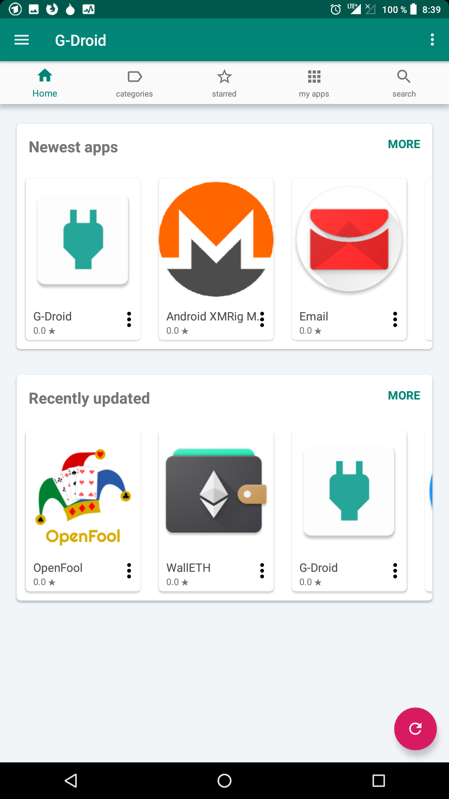
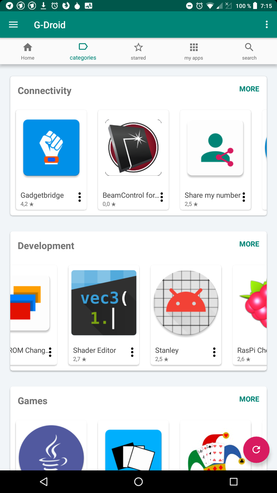
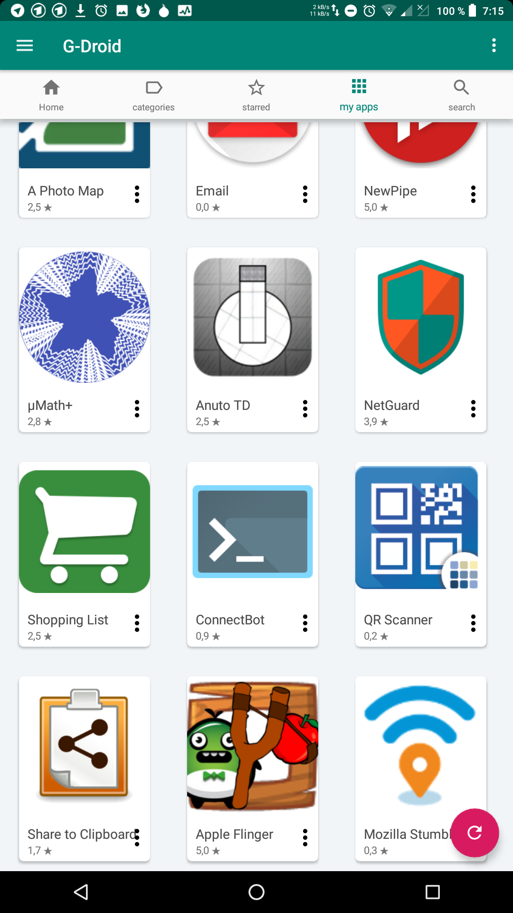

# What is this app

G-Droid can browse the free F-Droid app-repository. It is an alternative client to the F-Droid client.

# Screenshots

# Additional features compared to F-Droid

* star ratings of apps (up to 5 stars) - machine generated metrics
* shows the star upstream star ratings (github, gitlab, sourceforge)
* implements more metrics bases on open source data (like average release cycle time) to generate a star-rating
* let the users choose which metrics are important to them, so there is no 'best app' in the repo - there is only a 'best app' from the point of view of the current user
* shows 'similar apps' when watching an app
* shows web-site of the app - even if it is 'only a README file on github'. F-Droid has recently removed many websites to punish open source developers who can't effort their own domain.
* shows newest apps and recently updated apps separated
* shows cards in same size for better overview
* ability to 'star' apps to mark them
* shows categories in correct translation (if available) after changing language on the device
* shows screenshots in correct translation
* makes use of larger screens: show actually more apps on tablets
* tags to find apps for standard-tasks easily (email clients, file browsers, text editors), since the F-Droid categories are too broad
* view for 'random apps' to discover apps you usually wouldn't find
* aims to provide many different views to the app repository in order to assist the user to find what she wants to find and encourage to use more open source apps from the repository
* 'share' apps so it can still be opened with another store (F-Droid, Yalp, Aurora, ...), to get more information about the app.
* different search algorithm
* shows the logos of apps all the time (if network connection is okay)
* shows more screenshots
* shows screenshots, completely, up-to-date and in the correct language
* shows screenshots also when they are not in the fastlane structure
* has a new and modern codebase and is easy to maintain
* G-Droid is actively maintained (the F-Droid client is not any more)
* many more to come (G-Droid is just a few weeks old) ...

# Things that G-Droid can NOT do (yet) compared to F-Droid

* uninstall apps
* show or install an older version of an app
* create a local repo, share apps with 'near' people or share apps via bluetooth
* add other repositories than the F-Droid repo
* use the privileged extension
* update autmatically
* http proxy settings
* G-Droid helps you in different ways to find better apps: but in some cases you might still need the 'share' button, to open that app in F-Droid to install it. G-Droid right now is not yet a complete replacement for the F-Droid app.

# Things that are the same in G-Droid and F-Droid

* shows the same apps - G-Droid does not add any apps or modify the builds or download URLs
* all additional meta-data is provided by F-Droid as well (eg. the link to github)
* GPL3 license 

# FAQ

## Where to the ratings come from?

The implementation of the star ratings is not finalised yet. 

For now all that users can do is read the code. It is all open source. You can read on https://gitlab.com/gdroid/gdroiddata/blob/master/env/process_meta_metric.py how to extract metrics out of the f-droid repository. 

Essentially if you look at the F-Droid data you can extract and extrapolate things like:
*  time between software updates
*  age of the software
*  amount of screenshots

Following the source-link that F-Droid provides one can also access the source repo and get metrics
*  amount of code changes
*  code life time
*  contributors races
*  half-life of code blocks
*  ratio of abstract classes to normal classes
*  many other git, code and java metrics

Following the website that F-Droid provides one can also access the ratings that others provide on the upstream (github, gitlab, sourceforge, ...). There you can also, find amount of open bugs, average time to fix a bug or even determine abandoned project. 

And then all of it can be done for each app in the F-Droid repo and compared with each other.

Doing all these things manually is very cumbersome so G-Droid assists in that, to provide a better user experience.

And no. The data does not come from G-Droid users as there is (and will be) no tracking in the app. And is doesn't come from other stores, as that would be irrelevant information and mostly spam that has been bought for money (eg. in Googles play store).

## How can I add or remove an app from the tags?

If you are technically experienced you can look at this file: https://gitlab.com/gdroid/gdroiddata/blob/master/metadata/tags.yaml , change it and submit a merge request. If you don't have the technical expertise or don't have time to fiddle with it, you can open a new issue (https://gitlab.com/gdroid/gdroidclient/issues/new) or send an email. It will be sorted out for you. Either way, every contribution is welcome.
