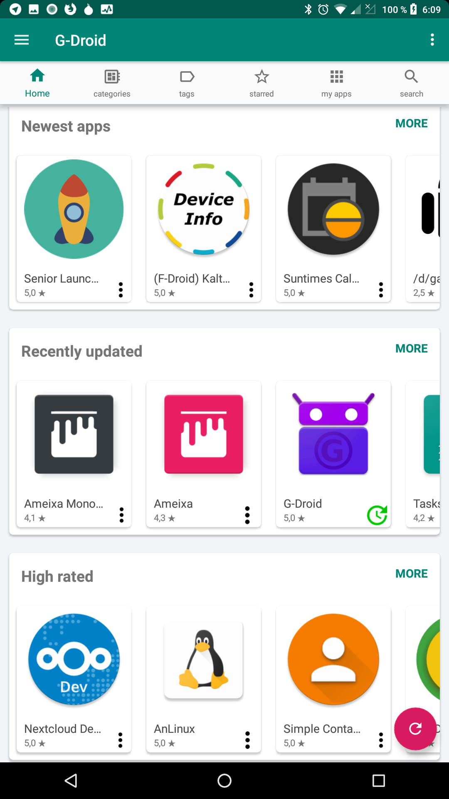

# What is this app

G-Droid can browse the free F-Droid app-repository. It is an alternative client to the F-Droid client.

# Screenshots

# Additional features compared to F-Droid

* shows reviews and comments for apps
* star ratings of apps (up to 5 stars) - machine generated metrics
* shows the star upstream star ratings (github, gitlab, sourceforge)
* implements more metrics based on open source data (like average release cycle time) to generate a star-ratings
* let the users choose which metrics are important to them, so there is no 'best app' in the repo - there is only a 'best app' from the point of view of the current user
* shows 'similar apps' and 'apps of the same category' when watching an app
* shows 'apps of the same author' when watching an app
* shows a list of all authors, with their apps and average star rating
* shows the web-site of the app even if it is 'only a README file on github'. F-Droid has recently removed many websites to punish open source developers who can't effort their own domain. This has been done with dodgy explanations and only for apps that the F-Droid team particularly dislikes (to censor apps they don't like).
* shows newest apps and recently updated apps separated
* does not censor the latest apps (F-Droid added [censorship](https://news.f-droid.org/posts/2019-03-26-the-latest-tab-now-highlights-good-descriptions/) on 26/03/2019)
* shows cards in same size for better overview
* provides a list-view as alternative for the cards (as in older F-Droid versions) for people who don't like cards
* has more possibilities to order and sort apps
* ability to 'star' apps to mark them
* ability to hide apps to remove them from all views
* shows categories in correct translation (if available) after changing language on the device
* shows screenshots in correct translation
* makes use of larger screens: shows actually more apps on tablets
* tags to find apps for standard-tasks easily (email clients, file browsers, text editors), since the F-Droid categories are too broad
* view for 'random apps' to discover apps you usually wouldn't find
* shows apps the user might like (without stealing the users data for analysis)
* aims to provide many different views to the app repository in order to assist the user to find what she wants to find and encourage to use more open source apps from the repository
* 'share' apps so it can still be opened with another store (F-Droid, Yalp, Aurora, ...), to get more information about the app.
* different search algorithm, can 'search harder' to continue a search if the results are insufficient
* shows the logos of apps all the time (if network connection is okay)
* shows more screenshots
* shows screenshots, completely, up-to-date and in the correct language
* shows screenshots also when they are not in the fastlane structure
* has a new and modern codebase and is easy to maintain
* G-Droid is actively maintained (the F-Droid client is not any more)
* many more to come (G-Droid is still pretty new and has only one developer [and many translators] right now) ...

# Things that G-Droid can NOT do (yet) compared to F-Droid

* create a local repo, share apps with 'near' people or share apps via bluetooth
* add other repositories than the F-Droid repo
* use the privileged extension (done, but extension is not adjusted yet), G-Droid can use root permissions on rooted phones though, to provide unattended installs
* update automatically
* http proxy settings
* G-Droid helps you in different ways to find better apps: but in some cases you might still need the 'share' button, to open that app in F-Droid to install it. G-Droid right now is not yet a complete replacement for the F-Droid app.

# Things that are the same in G-Droid and F-Droid

* shows the same apps - G-Droid does not add any apps or modify the builds, signatures or download URLs
* all additional meta-data is provided by F-Droid as well (eg. the link to github)
* GPL3 license 

# Explanation of permissions

* INTERNET: to download the app-metadata and the apps
* WRITE_EXTERNAL_STORAGE: To store the downloaded apps temporarily (permission only on older Android versions enforced)

# Translating

The app is translated using [Weblate](https://hosted.weblate.org/projects/g-droid/translations/). Follow [these instructions](https://hosted.weblate.org/engage/g-droid/) if you would like to contribute.

While you can also send merge requests or patches modifying the translations, Weblate is a much better way to go. Use Weblate - it applies a series of fixes and suggestions, plus it keeps track of modifications and fuzzy translations. Applying translations manually skips all of the fixes and checks, and overrides the fuzzy state of strings.

# Explanation of metrics

## Stars on Github/Gitlab/Sourceforge:

The stars are being counted for all apps from the same source and then normalised twice. The day of the first release (on F-Droid) will be taken as creation date of the app.
The number of stars will be divided by the number of days the app exists. So the new metric is 'stars per day'.
The stars per day are being compared to all other apps. The top 20% of all app will receive 100% for this metric. All apps below that will get a smaller percentage.

All apps in the top 20% of the list will receive 100% for this metric. All other apps will scale down from there on.

## Up-To-Date Percentage:

Indicates the up-to-date-ness in percent. An Update just 1 day ago is 100% and the last update over a year ago is 0%. This is being calculated
by the timestamp that F-Droid picks the update up, which can sometimes be a few days after the actual release.

## Release Cycle:

The release cycle is only shown for apps with at least 3 releases. It will show the average time between these releases to supply an indication on how active the app is being developed.

The app had a release on 27/11/18, then on 17/12/18 (20 days later) and then on 29/01/19 (43 days). The average release cycle is 31.5 (=(20+43)/2) days so it will be shown as 32 days.

# FAQ

## Where do the ratings come from?

The implementation of the star ratings is not finalised yet. 

For now all that users can do is read the code. It is all open source. You can read on https://gitlab.com/gdroid/gdroiddata/blob/master/env/process_meta_metric.py how to extract metrics out of the F-Droid repository. 

Essentially if you look at the F-Droid data you can extract and extrapolate things like:
*  time between software updates
*  age of the software
*  amount of screenshots

Following the source-link that F-Droid provides one can also access the source repo and get metrics
*  amount of code changes
*  code life time
*  contributors races
*  half-life of code blocks
*  ratio of abstract classes to normal classes
*  many other git, code and java metrics

Following the website that F-Droid provides one can also access the ratings that others provide on the upstream (github, gitlab, sourceforge, ...). There you can also, find amount of open bugs, average time to fix a bug or even determine abandoned project. 

And then all of it can be done for each app in the F-Droid repo and compared with each other.

Doing all these things manually is very cumbersome so G-Droid assists in that, to provide a better user experience.

And no. The data does not come from G-Droid users as there is (and will be) no tracking in the app. And it doesn't come from other stores, as that would be irrelevant information and mostly spam that has been bought for money (eg. in Googles play store).

## How can I add or remove an app from the tags?

If you are technically experienced you can look at this file: https://gitlab.com/gdroid/gdroiddata/blob/master/metadata/tags.yaml , change it and submit a merge request. If you don't have the technical expertise or don't have time to fiddle with it, you can open a new issue (https://gitlab.com/gdroid/gdroidclient/issues/new) or send an email. It will be sorted out for you. Either way, every contribution is welcome.

## What does the 'search harder' and 'search even harder' do?

* The normal search is searching only in the app names in your language (yes, apps can have different names in different languages).
* 'search harder' includes the app-summary into the search, which is a short description of the app in one or 2 sentences.
* 'search even harder' includes also the app description in the search result. This is similar to the search in the F-Droid client. The result will contain a maximum of results but many of them might be irrelevant.

## Where do the similar apps come from?

They are calculated by this R script https://gitlab.com/frief/app_match.r made by Frieder Ferlemann. Please check it out and feel free to contribute to it, if you'd like to improve the similar apps.

## Where do the comments for each app come from?

They are mastodon toots, mentioning the G-Droid account and using a special hashtag for each app. The hashtag is the package name of the app where dots are being replaced by underscores. In G-Droid you can simply use the button 'write comment' to create a comment-toot for an app.

## Loading app icons takes a long time. Can they be cached?

The F-Droid server has sporadic performance issues. This causes the load of icons, but also the update of the repository and the download of the APKs to be very slow.
The problem is being investigated. It might be resolved by using mirrors in future.

The app icons and all other images (like screenshots) are being cached. There have been reports, where all images are being reloaded all the time. 
If you have this error, please check if you have an 'optimizer' app running in the background that deletes the cache of some apps all the time. If so: disable this behaviour.
Apart from that, the Android OS will use free space on your device to cache the app icons in G-Droid. This happens automatically with the Glide library.

